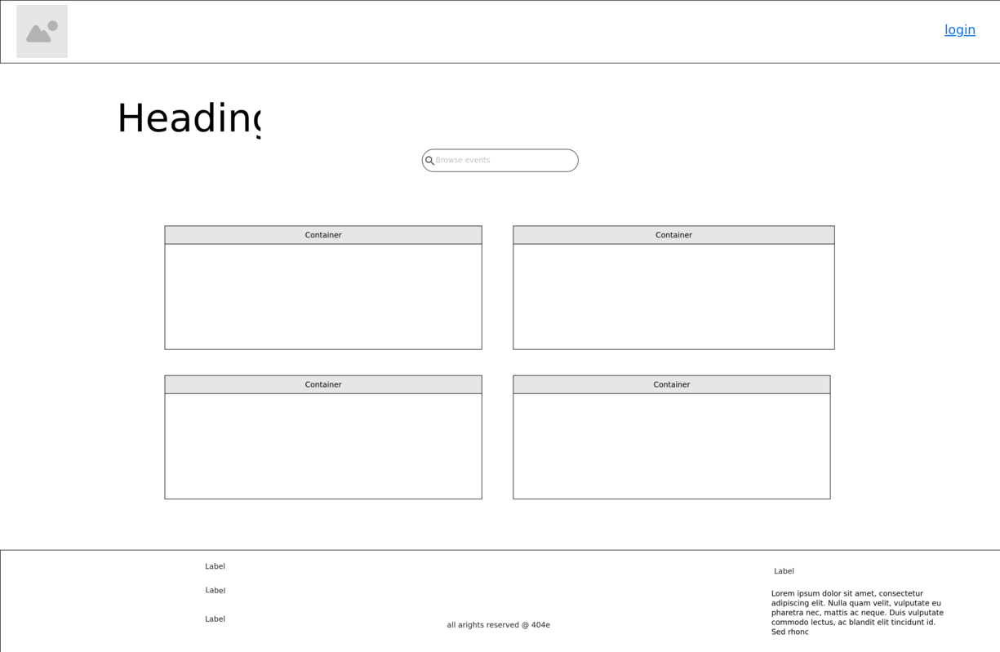
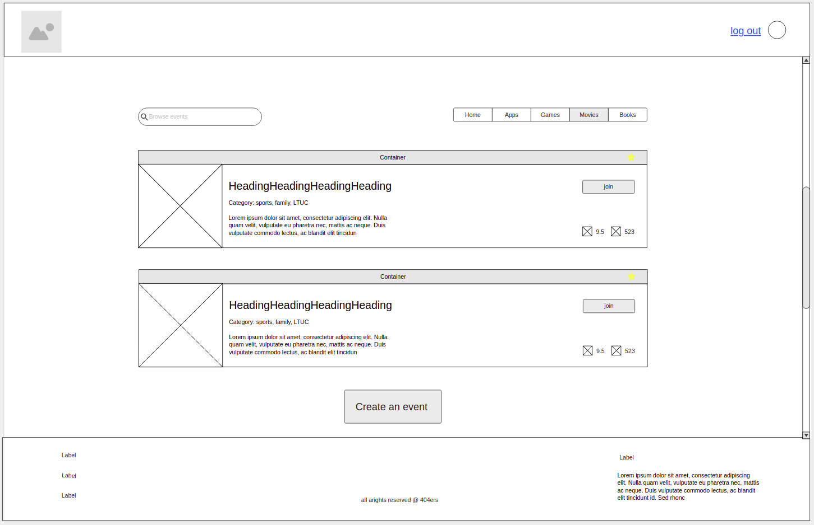
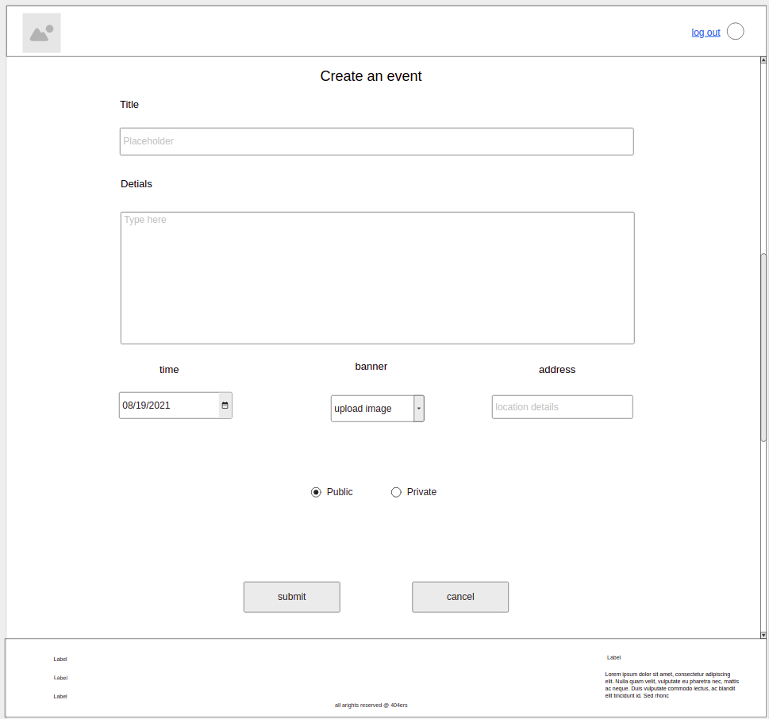
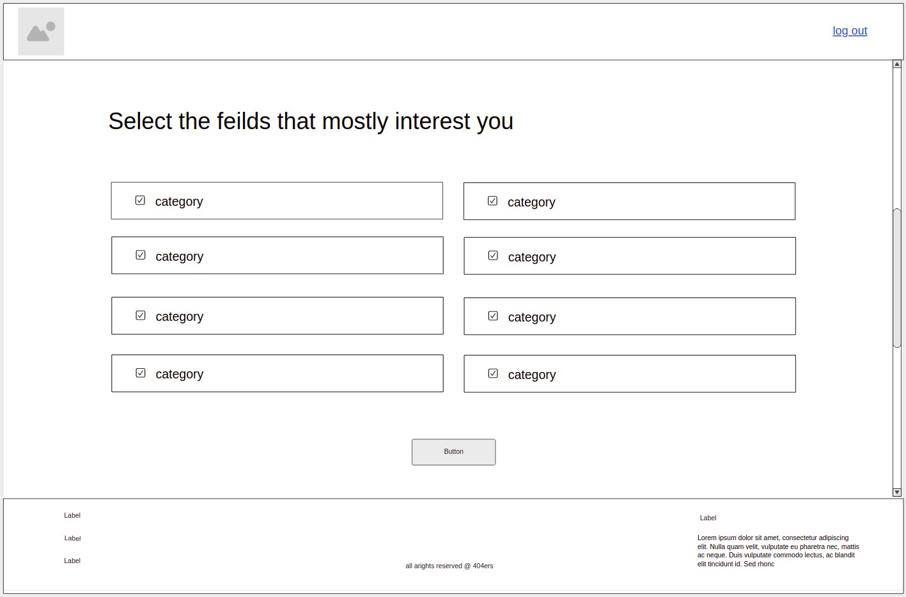
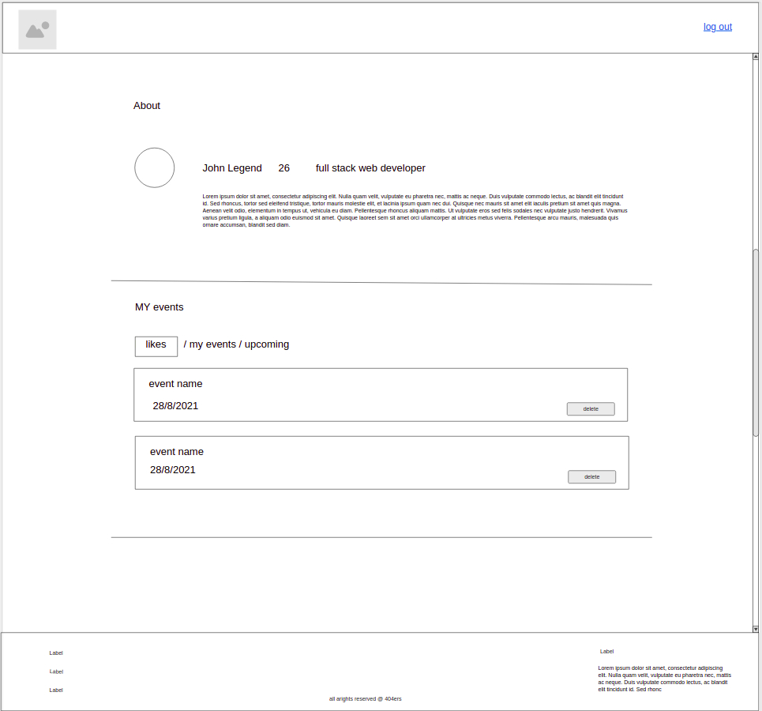
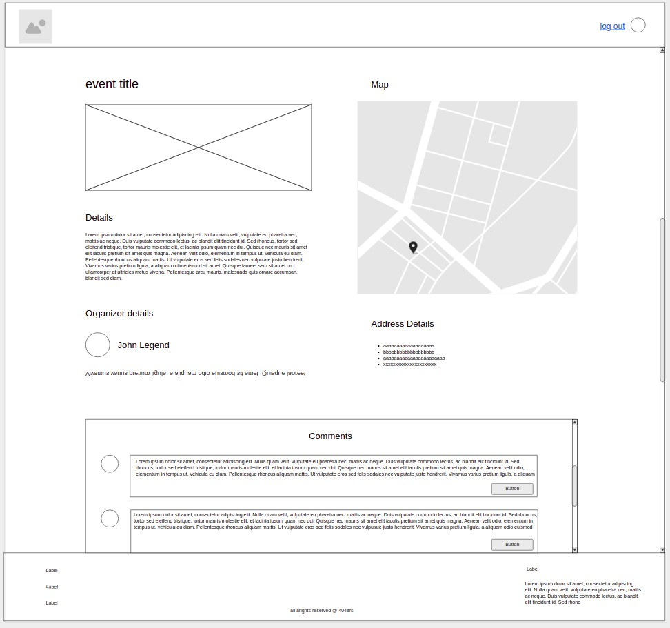

# eventome-fe

## Team agreement - ASAC 301 final project

**Team: 4O4ers** - **Team Members: Adham Mhaydat, Ali Alhjouj, Balqees Alfasatlah, and Hamza Ahmad.**

## Cooperation Plan

This awsome team has four main members, namely, Adham Mhydat, Ali Alhjouj, Balqees Alfasatlah, and Hamza Ahmad. Talking about the strengths that make everyone of us unique, we start with Adham, who has strong skills in Javascript especially when it comes to utilizing functional programming concepts, and CSS to style and add amazing styles to what he builds, he is also so innovative and a creative designer who can also easily work under pressure. Talking about Ali, he is a really good team player, who can also work under pressure, he also has strong abilities to manage his time which will help us greatly as a team to acheive what we want on time. Ali is also a good communicator. About Balqees, she is among the most creative persons you could ever meet, and she has no problems working under pressure, but most importantly, she is always aiming to make herself a better person though continous learning and improvement. Hamza Ahmad is a person who considers every difficulty an opportunity, and he is always looking forward to improve as much as he can.

We believe that we can take advantage of all of these strength points by allowing everyone to express his or herself with not pressure or critiques, all of the members of this team aim to improve though working on this project, and they also aim to give as much as they can, so we will not worry about anyone procrastinating or not doing their jobs as expected. Time management skills are highly appreciated, and they will help us plan and finish the tasks on time with no issues.

All of the members of this team aim to improve their comminication skills for the better, we are also aiming to become better in handling issues when resources are scarse, so that we become more independent, and utilize our critical thinking skills much more than usual, the thing that will help us greatly though this project.

In order to make sure that every member understands clearly everything needed though the course, we agreed on making the communicaton channels available anytime, where if in need, the member can summon the team in order to help with his or her issue. We will also conduct various meetings to review all the tasks that we have finished and the ones that are to be planned, so that everyone stays updated at all times. We will also rely greatly on reading, in order to gain more insights into the problems or concepts we face.

## Conflict Plan

We always hope that we do not face any conflicts, however, things happen, but we have planned our way through all of these issues. Most importantly, we will always try to keep an open mindset, and to be as democratic as possible, we plan to make a vote in case we face something that might cause everymember to have a differnt opinion, and we all agreed to go with the one that wins the most votes. But to resolve real conflicts, we agreed on trying to solve the issue rationally and by discussing and taking into consideration the opinion of the conflicting members, but in case this does not work, we agreed to relay the message to the instructional team after trying and trying to solve the issue internally.

Again, we plan to make many meetings on differnt topics or themes, so some of them will focus mostly on checking the mental progress or if all members are following though the project, to make sure that all of us are on the same page, and we will all be available if someone faces an issue or a misunderstanding for some concept or task.

Although I am the team leader, it does not mean that I am on a higher level or that I have some extra priviliges, but instead it is a responsibility, and I must also be questioned in case I do not do my job as expected, and this is also expected to be done to anyone who does not contribute as expected, knowing that we will take into consideration the differences and the cabapilites of each single member, and we are always ready to cover up for any one of us in case he shows a lack of specific skills, knowing that we will try to help them understand and focus on thier other strengths.

In case a conflict does not get solved after some time to the point it affects the flow of work, we will escalate that to the instructional team within 6 hours of the time of that conflict.

## Communication Plan

The team has agreed on keeping all communication channels or means avaialable all the time, however, when anyone has an urgent task or an emergency, we agreed on execusing them. We will be using mostly Zoom for meetings, and sometimes Discord, we have also created a WhatsApp group for things that require immediate response.

We left the timing of breaks to be flexible, so that we utilize the time when all of us are in a good mood and energy to the maximum, in addition to the fact that sometimes leaving breaks to be strictly planned might couse the one to lose focus especially if they do not feel like taking a break, knowing that it is ok for anyone to leave in thte middle of a discussion if he or she really needs to and we agreed to recap everything until they come back unless the dicussion is about something that is so important.

If we start to fall behind the schedule, we agreed to shorten the break time, and try to complete the tasks after working hours, so it is not a big of a problem to anyone to sacrifice their time to serve the team.

To make sure that everyone feels comfortable, we agreed on avoid any persona judjments by anyone to anyone, we also agreed on taking into consideration the opinion of every member no matter how unimportant they think it is. We also assured ourselves that we are all in this together, so we succeed as a team or we fail as a team.

## Work Plan

To start, we will let all the members explain themselves and talk about themselves freely, they will also describe what makes them more comfortable doing, and what are thier main skills especially the technical ones related to the project. After that, based on the outcome, we will break down the project into small pieces or parts, and make everyone handle even a smaller part of that part, so that no one feels like they are handling more than anyone else. This will also take into consideration the points discussed in the beginning.

We will be using Zoom and Trello to manage and organize our time and tasks, and sometimes just casually using any communication channel available like WhatsApp and Slack.

## Git Process

Almost all of the components of our project will live on GitHub, especially code related things. We have already created an organization for out team, and we added the repositories that will contain the main project, all of the members have been added to that organization and have the access to modify and upload code and push thier latest work and once that is done, all of the team will pull that latest update to their local machine. We will try to make everyone work on a separate file at a time, except when doing pair programming, to avoid having conflicts as much as possible.

We agreed on making Hamza Ahmad and Adham maintain and handle reviewing pull requests, Hamza will also handle merging pull requests and might need to summon any of the members to help when needed. We will mostly push and merge as soon as a task is done to avoid waiting to start working on remaining tasks. We will be communicating that though zoom most of the time.

---

## Previously discussed ideas:

**A:**

1. Event hosting website (approved)

2. This project aims to offer people a place to check for events near them and any other relevant information about that event. / Users will have the ability to host or create their own events / users will have the ability to interact with other people who showed interest in similar events.

3. The Minimum Viable Product of this idea is to allow users to know about events they are interested in/ the users should be able to create and host thier events at any time given they are authorized/ users should be able to check the details of events near them and see the map to go to that event with ease.

**B:**

1. Task Manager

2. This idea aims to allow the user to add as many tasks as he wants/ he will be able to check his progress and get notifications or reminders for a specific task based on the schedule he puts for himself/ the user will be able to update or modify the tasks even after they add them at any time.

3. The MVP for this idea is that the user be able to add tasks with ease/ to receive reminders to notify him about the current and upcoming tasks / and to allow the user to update and modify a task with ease.

---

## APIs

Auth0 - Stytch - Eventbrite - Picatic - SeatGeek - Full Contact - Places API - Gmail - Google Analytics - mailgun - Abstract IP Geolocation - apilayer ipstack - Battuta - Geoapify - Geocoding.ai - Google Maps - OpenStreetMap - RoadGoat Cities

---

## Wireframe

1. main before login

2. main after login

3. event creation 

4. preferences when loggin in

5. profile

6.event details
